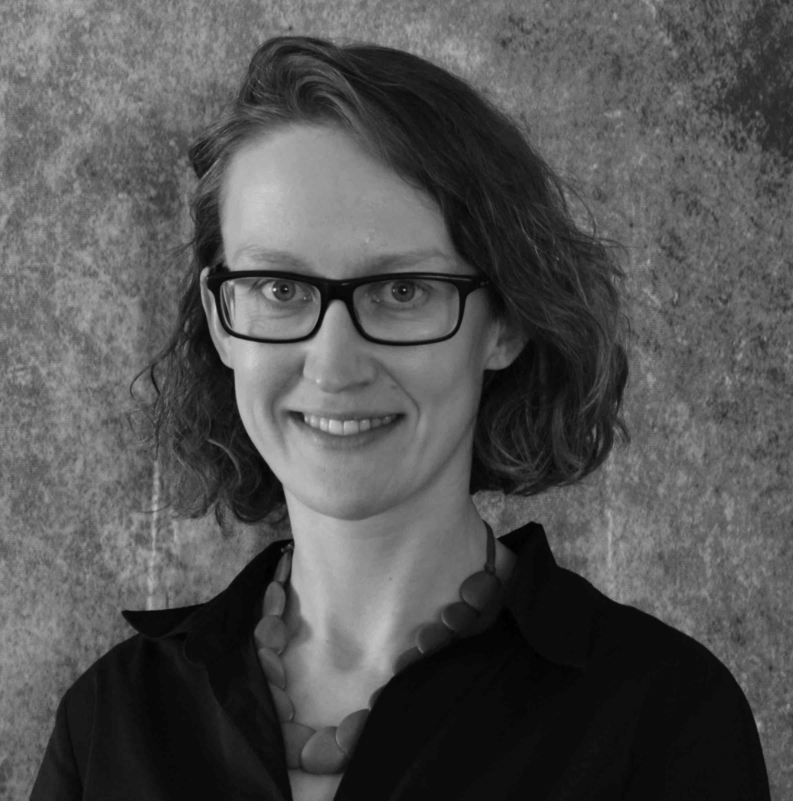

# Katarina Slama

Hi! I'm Katarina and I work as a Data Scientist in the security, risk and fraud area at Intuit. Previously, I was an [OpenAI Scholar](https://openai.com/blog/openai-scholars-spring-2020/). This site contains my blog for the program. I also sometimes blog on [Medium](https://katarinaslama.medium.com/) and I [tweet here](https://twitter.com/katarinaslama).

I have a PhD in [Neuroscience from UC Berkeley](https://neuroscience.berkeley.edu/ph-d-program/),
where I studied [attention using intracranial recordings](https://scholar.google.com/citations?user=mOCKfhoAAAAJ&hl=en&oi=ao)
in humans.

Between college and graduate school, I worked as a laboratory manager in the
[Nock Lab](https://nocklab.fas.harvard.edu/research) at Harvard, studying suicide
and self-injury.

I have an ScB in Psychology from Brown University. As an undergraduate, I worked
on research projects with [Michael J. Frank](https://www.lnccbrown.com/) (deep
  brain stimulation and moral decision-making) and [Cynthia Garcia Coll](https://www.psychologicalscience.org/observer/champions-of-psychology-cynthia-garcia-coll)
  (child development and immigration).

Before I got all focused on progressively smaller building blocks of cognition, I took
a more global perspective: For my gap year before college, I worked in [this refugee camp](http://www.theborderconsortium.org/where-we-work/camps-in-thailand/mae-la-oon/), having spent my late teens at [this magical school](https://www.atlanticcollege.org/).
